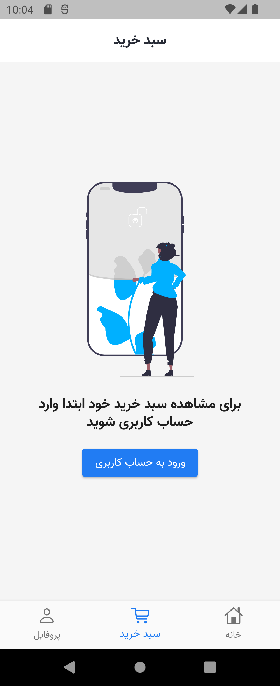

# nike_ecommerce

Welcome to Nike Ecommerce, a Flutter application for buying Nike shoes online.

## Features

- Online and in-store purchasing options
- Wishlist: Add your favorite products to the wishlist
- Product reviews: Leave reviews and ratings for products
- User registration and login
- View purchase invoices
- Product filtering options

## Screenshots

  

  
  
  

  

  
  

  

  

## Installation

1. Clone the repository: `git clone https://github.com/seyed-ali-hosseini-nasab/nike_ecommerce.git`
2. Change to the project directory: `cd nike_ecommerce`
3. Install dependencies: `flutter pub get`
4. Run the app: `flutter run`

## Requirements

- Flutter SDK
- Dart

## Contributing

Contributions are welcome! If you have any suggestions or find any issues, please create a new issue
or submit a pull request.

## License

This project is licensed under the [Apache License 2.0](http://www.apache.org/licenses/LICENSE-2.0).

## Author
Saeed shahini

email: hoseininasabian110@gmail.com

github: https://github.com/seyed-ali-hosseini-nasab
